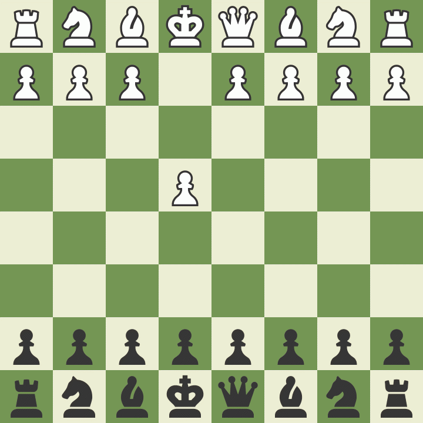

 I'm Spencer, my first computer was a ZX81 and that's where the love affair started. I am currently working at Ocean Infinity, and before at L3Harris as a senioe specialised full stack developer using the MERN stack alongside Geospatial technologies. Before then I was in PwC (Price Waterhouse Coopers) as a programming senior manager, I looked after a team of around forty developers and worked together using Python (Django and Flask in particular), JS (Node, React and Vue too), the usual web front end stuff. Sometimes we get to play with Java, if you could call it that! 

My GitHub at the moment isn't very active as at work we have our own private repos being that L3Harris has its own private repos and PwC being a financial conglomerate.

### Languages

### Frameworks and Libraries

### Tools, platforms and applications

I am currently working on a traditional pen and paper role-playing conversion to an API. I love working with open source and geospatial mapping, not all my interests are nerdy; I also love playing Chess and watching Star Trek :) 

 
